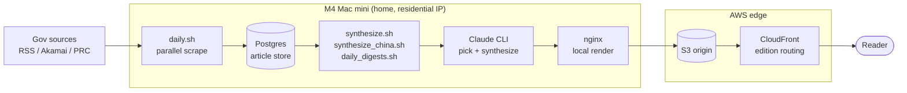

# briefer.news

A daily intelligence platform on multi-government output. Autonomously scraped, curated, and synthesized into a published page per edition each morning.

## What it is

Every morning, this pipeline scrapes ~125 active sources of government output across two editions:
- **US edition** — ~93 sources (65 standard RSS/web + 28 Akamai-protected .mil/allied: State Dept, CENTCOM, DOJ, Treasury, CISA, Federal Register, UK MoD, DFAT, Japan MoFA, NATO, etc.) → brief at **https://briefer.news/usa/**
- **China edition** — 32 Chinese-government sources (MFA, State Council, Xinhua, NDRC, PBOC, MIIT, CAC, Qiushi, CCDI, NPC, judicial, provincial, etc.) → brief at **https://briefer.news/china/**

A few hours after each scrape, Claude curates the most consequential ~50 items per edition and synthesizes them into a 9-bullet daily brief in the style of [`BRIEF_STYLE.md`](BRIEF_STYLE.md). The China brief follows additional editorial rules in [`CHINA_BRIEF.md`](CHINA_BRIEF.md) (bilingual voices, diplomatic-vocabulary calibration, internal-evolution priority).

The site root **https://briefer.news** is an editions selector with live-fetched headlines from each edition. Designed to scale to additional country editions (UK / EU / Russia planned).

## Architecture

**[Interactive pipeline flow map →](https://ghanzo.github.io/briefer.news/pipeline-flows.html)** — click any flow (overnight scrape, publish a brief, refresh digests, edition routing) to trace it step-by-step through every component, annotated with what is passed between them. Source: [`docs/pipeline-flows.html`](docs/pipeline-flows.html).



**Why the mini specifically:** Akamai bot-detection on DoD `.mil` subdomains blocks cloud datacenter IPs. The mini's residential ISP is what makes the curl_cffi Chrome-impersonation bypass actually work. Verified live for war.gov, centcom.mil, navy.mil, jcs.mil, af.mil. See [`archive/research/dod_bypass_findings_2026-05-07.md`](archive/research/dod_bypass_findings_2026-05-07.md).

## Daily flow

Claude calls are spread across the early-morning hours so the shared `claude` CLI quota is never contended. Core publishing flow (PDT):

| Time | LaunchAgent | What |
|---|---|---|
| 00:30 | `news.briefer.daily` | **3 scrapes in parallel** — RSS (65) + Akamai (28) + China (32) → Postgres, then DB cleanup (**14-day retention**) |
| 02:30 | `news.briefer.synthesize` | World-context (Claude WebSearch) → SQL pre-filter → Claude picker (~50) → SQL fetch full text → Claude synthesizer → `validate_brief` gate → deploy `/usa/` + S3 + CloudFront |
| 04:00 | `news.briefer.synthesize.china` | SQL pre-filter (internal + reserved MFA) → Claude picker (≥6 MFA) → synthesizer (bilingual voices, diplomatic-glossary calibration) → `validate_brief` gate → deploy `/china/` + S3 + CloudFront |
| 05:30 | `news.briefer.digests` | archive index + weekly "This week" injection + sitemap + per-edition RSS feeds |
| 06:30 | `news.briefer.healthcheck` | verify both briefs published today; auto-recover (one synth/day) + alert if stale |
| 07:15 | `news.briefer.feedfreshness` | per-source freshness watchdog — flags feeds that went silently stale |
| 08:30 | `news.briefer.email_send` | US-only daily email to subscribers (gated on US-brief freshness) |
| 09:00 | `news.briefer.alertdigest` | one daily digest of the day's operational alerts (no per-alert email spam) |
| 12:30 | `news.briefer.midday` | bonus midday corpus refresh (scrape only — no synth, no cleanup) |
| 13:05 | `news.briefer.synthcatchup` | resynthesize if the morning brief is missing/stale (self-limited to one real synth/day) |

Plus growth/ops agents (researcher, drafter, morning-brief, traffic + engagement reports, search-console report, subscriber backup, email API/bounce handlers). Full list: [`launchd/`](launchd/).

Logs: `logs/daily-YYYYMMDD.log`, `logs/synthesize-YYYYMMDD.log`, `logs/synthesize-china-YYYYMMDD.log`, `logs/feed-freshness-YYYYMMDD.log`, `logs/alerts.log`. Failures are non-fatal — `validate_brief` keeps yesterday's brief live until the next successful synth, and a feed-freshness watchdog + daily alert digest surface silent degradation off-box.

## Editorial framework

| File | Purpose |
|---|---|
| [`BRIEF_STYLE.md`](BRIEF_STYLE.md) | Style rules: 9 events (all visible, each click-to-expand; no "show more" group expander), 6 voices, 5–8-word headline, plain English, ≤2 DOJ items, ≤3 purely-domestic items, named actors, sourced citations |
| [`lens.md`](lens.md) | Interpretive framework: energy/resources, US-China axis, tech chokepoints, financial currents, human systems, innovation signals |
| [`archive/docs/AIMS.md`](archive/docs/AIMS.md) | Long-arc themes and predictions (archived) |
| [`archive/docs/COVERAGE.md`](archive/docs/COVERAGE.md) | Thematic dimensions / categories (archived) |
| [`CLAUDE.md`](CLAUDE.md) | Orientation for Claude sessions working in this repo |

## Setup on a new machine

The full schedule of **21 LaunchAgents** is committed in [`launchd/`](launchd/);
[`scripts/install_launchagents.sh`](scripts/install_launchagents.sh) (`make
agents-install`) reconstructs the live schedule from git on a fresh machine. The
historical Mac mini deployment runbook is archived at
[`archive/docs/MIGRATION.md`](archive/docs/MIGRATION.md).

For local development:

```bash
cp .env.example .env
# Edit .env — set POSTGRES_PASSWORD; AI keys optional (uses Claude Code by default)

docker compose up -d postgres nginx
# Local site at http://localhost (after first synthesize run)

# Manual scrape (RSS + Akamai-protected):
docker compose run --rm pipeline python main.py --scrape-only
docker compose run --rm pipeline python main.py --akamai-only

# Manual synthesis (requires `claude` CLI installed and authenticated):
scripts/synthesize.sh
```

The `pipeline` container is profile-tagged (`profiles: [manual]`) so it doesn't auto-start with `docker compose up`. It's invoked on-demand by the operations scripts.

## Project layout

```
briefer.news/
├── pipeline/                       # scraping + DB
│   ├── config/sources.yaml         # ← standard RSS/web feeds (65 active)
│   ├── config/akamai_sources.yaml  # ← Akamai-protected .mil/allied feeds (28 active)
│   ├── config/china_sources.yaml   # ← Chinese-government feeds (32 active)
│   ├── scraper/                    # discovery, extractor, akamai_bypass, browser
│   │   ├── akamai_bypass.py        # curl_cffi TLS-impersonation fetcher
│   │   └── akamai_scrape.py        # orchestrator for .mil sources
│   ├── processor/filter.py         # Groq scrape-time relevance pre-filter (only live processor code)
│   └── db/models.py                # SQLAlchemy schema
│   (legacy Grok/Gemini/Claude summarizers + Jinja builder archived 2026-06-01 → archive/pipeline/)
├── scripts/                        # operational scripts (LaunchAgent targets)
│   ├── daily.sh                    # 00:30 — parallel scrapes (rss+akamai+china) + cleanup
│   ├── synthesize.sh               # 02:30 — US synth → /usa/
│   ├── synthesize_china.sh         # 04:00 — China synth → /china/
│   ├── cleanup.sh                  # 14-day article retention (DB + log rotation)
│   ├── feed_freshness.py           # per-source staleness watchdog (07:15)
│   ├── alert.sh / alert_digest.sh  # off-box alerts → one daily digest (09:00)
│   ├── email_send.py / email_template.py  # US-only daily subscriber email (08:30)
│   ├── redeploy_today.sh           # re-publish today's brief without re-synthesizing
│   └── world_context.sh            # Claude WebSearch → ambient global-narrative file
├── research/                       # design references, sample briefs, probe scripts
│   ├── prototype_us_2026-05-12.html      # CURRENT US template (dark default, nav strip)
│   ├── prototype_china_2026-05-12.html   # CURRENT China template (red theme, PRC flag)
│   ├── prototype_selector_2026-05-12.html # CURRENT home selector (two-card layout)
│   ├── prototype_2026-05-07.html         # original US template (kept; superseded)
│   └── brief_*.md                  # human-written reference briefs
├── docs/pipeline-flows.html        # interactive pipeline flow map (served via GitHub Pages)
├── nginx/nginx.conf
├── docker-compose.yml
├── BRIEF_STYLE.md                  # editorial style guide
├── lens.md                         # interpretive framework
├── CLAUDE.md                       # orientation for Claude sessions
├── INDEX.md                        # root-doc map (purpose + freshness tag)
├── Makefile                        # operator entry point (`make status`)
├── launchd/                        # the 21 LaunchAgents (source of truth)
└── archive/docs/MIGRATION.md       # historical M4 mini deployment runbook
```

## Status snapshot

| | |
|---|---|
| Source pool | **~125 active feeds** — ~93 US (65 RSS/web + 28 Akamai-protected) + 32 Chinese-government |
| Daily article volume | ~200-300 net new articles/day after dedup; 14-day rolling DB retention |
| Local site | Live at http://localhost on the mini |
| Public domain | **Live** at https://briefer.news (multi-edition) since 2026-05-12 |
| US edition | Live at https://briefer.news/usa/ — autonomous synth 02:30 PDT |
| China edition | Live at https://briefer.news/china/ — autonomous synth 04:00 PDT (since 2026-05-12). Bilingual voices, internal-evolution framing |
| Selector | Live at https://briefer.news/ — JS-fetched headlines from each edition |
| AWS cost | ~$0.50/mo (Route 53 zone only) |
| Mini cost | ~$3/yr electricity (M4 idles at ~3W) |
